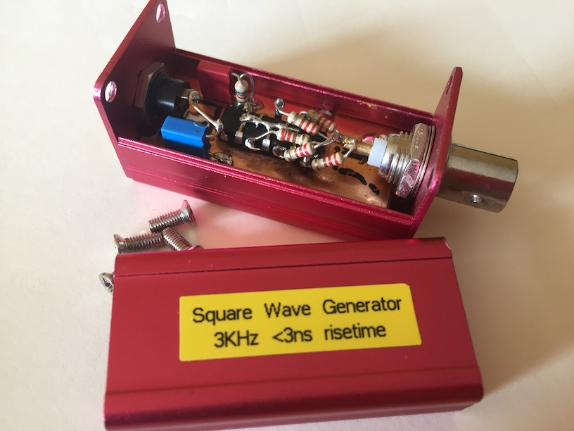
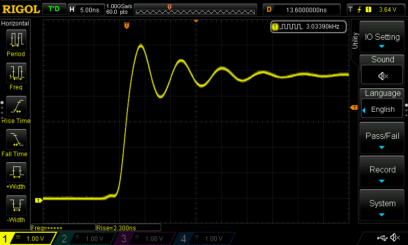
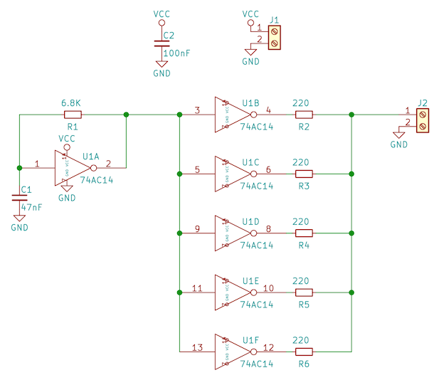
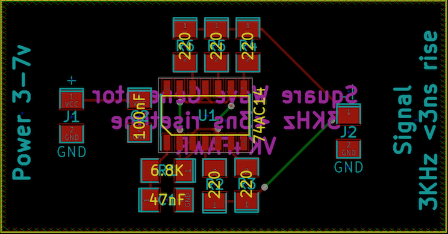
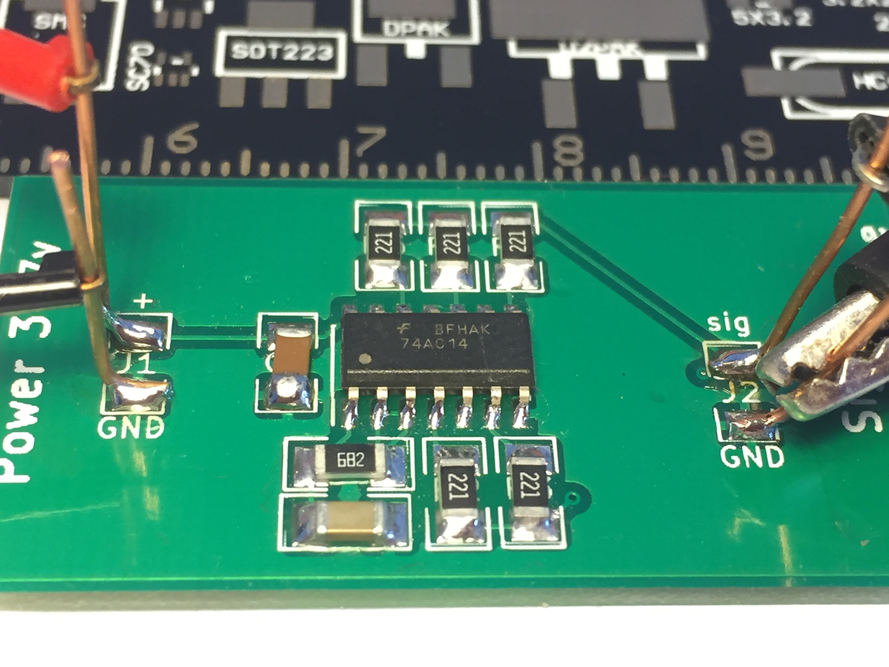
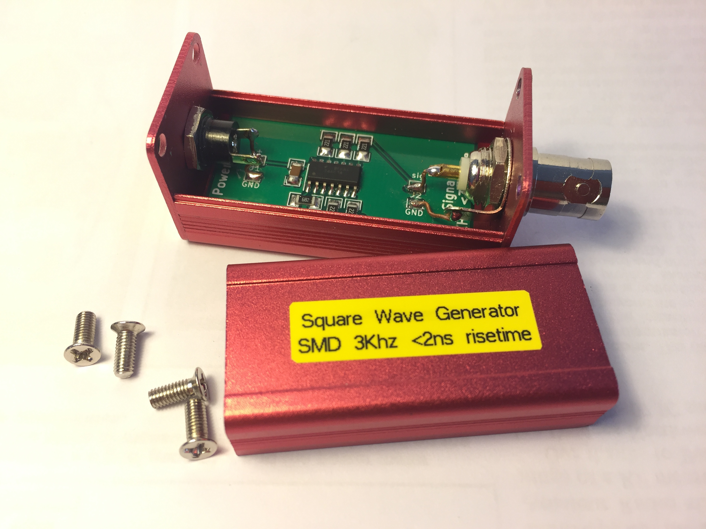
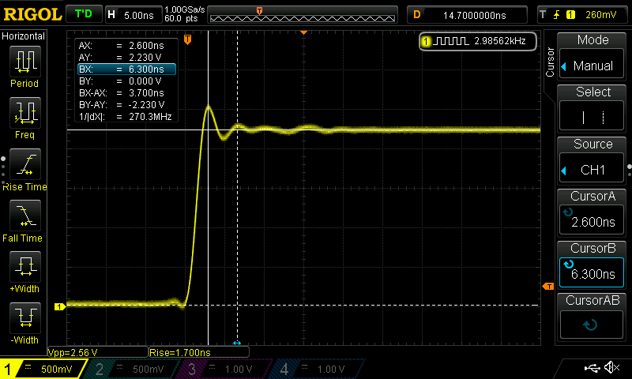
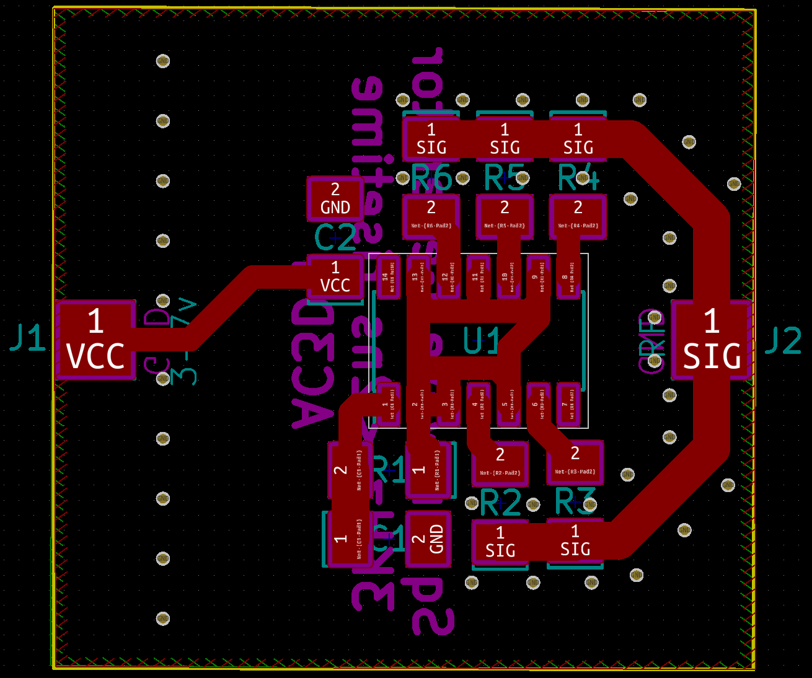

SquareGen
=========

This project is a repackaging of the fast risetime Square Wave generator
that I built from the 
`video by W2AEW on YouTube <https://www.youtube.com/watch?v=9cP6w2odGUc>`_.
I originally put this circuit into an enclosure using the "dead bug" style
and it worked pretty well.  Here's the built circuit:

And here's the circuit running on the 'scope:

Not bad for a cheap little circuit.  It draws less than 3mA at 5volts, unloaded.
About 30mA into a 50 ohm load.

I have been building circuits on PCB lately using the PCB shops in China with
through-hole components, but now I want to get into surface-mounted components
so I'm using this circuit as a guinea-pig.  Using KiCAD here's the schematic:

and the PCB itself:

I'll put the PCB into the same 25x25x50mm enclosure as the first circuit, so the
PCB measures about 44x23mm.  I got the enclosures 
`from here <https://www.aliexpress.com/wholesale?catId=0&initiative_id=SB_20180825211723&SearchText=50x25x25mm+Extruded+Aluminum>`_.

18 October 2018
===============

The SMD PCB is back from China and the circuit has been built.  Here is the
assembled board being tested:

and the board installed in a small 25x25x50mm case:

With the generator working into a 50 ohm load it draws about 30mA at 5v.  Here's
a close look at the leading edge of the 3KHz square wave.  Risetime is even
better than the first version at 1.7nS:

Next version
============

The SMD version above works very well, but there are a few things that could be
improved, such as:

* thicker connections on the output side,
* 50 ohm connections to the output pad,
* better power/RF connection pads,
* use a groundplane on the back side of the board.

The board is sized to fit into the 25x25x50mm case *diagonally* which will allow
much shorter connections for power and signal.  Here's the PCB:

